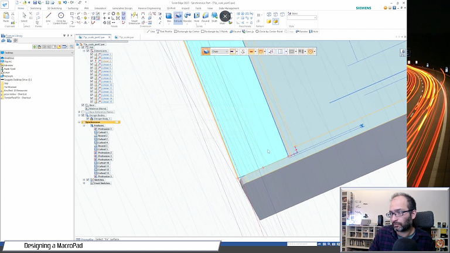

# PSX-Style Macro Pad

This is a very simple and hacking yet functional Macro-pad keyboard.
I am using a Pi Pico (RP2040) from WaveShare in the form of the RP2040-Zero.  

Since I only have 9 keys, and the RP2040 has more than enough GPIOs, I just wired each switch to a GPIO (0 through 8).  

Each GPIO is set as a pull-up input, and each switch bridges said GPIO to ground.
Just for some instinctive fear of peak currents, I also added a 1kOhm resister between all the switches and the ground-pin.
This is not strictly needed and may cause issues that I did not think of, but it works on my implementation.

# Simple Code
View the simple subfolder of this git. It is a very basic setup for getting F13 to F21 working. To use it copy the contents of the *simple* sub-folder into the root directory of the rp2040.

# KMK
I adapted KMK firmware to work on this setup. To use it copy the contents of the kmk_base *sub-folder* into the root directory of the rp2040.

## Youtube Description (How I designed it / critic) 

## Finished Goods

  
## Wiring
